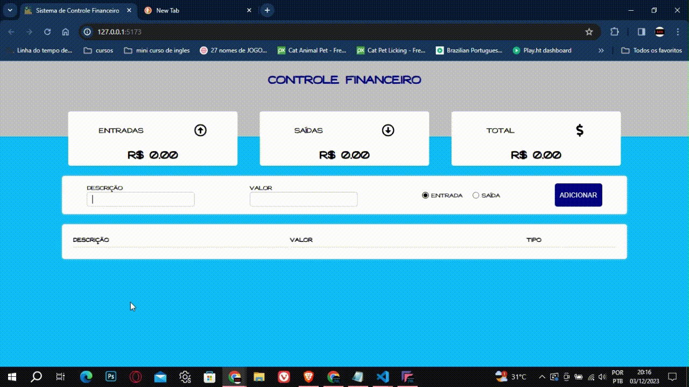

# 👨‍💻 Projeto - Sistema de controle Financeiro desenvolvido em ReactJS. 

Neste projeto desenvolvido em ReactJS e Styled Components, o objetivo é fazer com que o usuário faça um controle financeiro de seus gastos, colocando os valores de suas despesas no campo de entrada e o sistema gera uma saída total dos gastos que o usuário deve ter.

## ⚠ Pré-requisitos

- [Node.js](https://nodejs.org/) - Certifique-se de ter o Node.js instalado na sua máquina.

## 🚀 Tecnologias Utilizadas

Este projeto foi desenvolvido em: 
 
-  (para criar o projeto)
-  (para rodar o projeto)
-   
-  

## 🗂 Estrutura do Projeto

- `src/Components`: Esta pasta contém o código-fonte do projeto separada por outras pastas. 
- `assets/`: Aqui estão armazenados recursos estáticos, como imagens, gifs.
- `App.jsx`: Componente principal onde está localizado o código principal do projeto contendo a lógica responsável por renderizar o cabeçalho, o resumo financeiro e o formulário para adicionar novas transações.
- `node_modules/`: As dependências do projeto são instaladas nesta pasta.
- `package.json`: O arquivo de configuração do Node.js que lista as dependências e scripts.
- `README.md`: Este arquivo, que fornece informações sobre o projeto.

## 💻 Demonstração

 

### Você pode testar o site através deste [Link](https://controle-financeiro-psi-seven.vercel.app/)

## ⚙ Licença

Este projeto é licenciado sob a Licença MIT - consulte o arquivo [LICENSE](LICENSE) para obter detalhes.

## 📋 Autor

-Leonardo Santana
